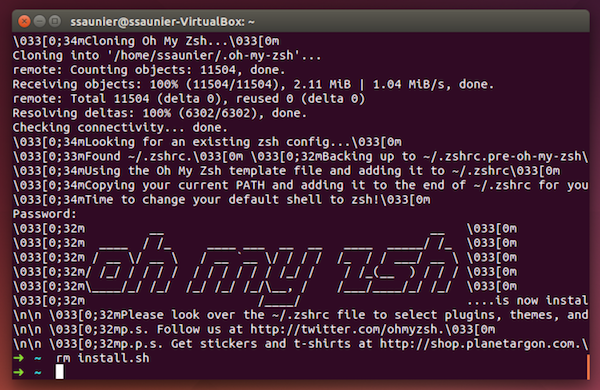

# Instruções

As instruções abaixo te ajudarão a:

- Ter um editor de texto (Sublime Text 3)
- Instalar um package manager no seu Linux
- Melhorar seu Terminal
- Setup Git e GitHub
- Instalar o Ruby


## Conta no GitHub

Se ainda não tem uma conta no GitHub, [crie ela aqui](https://github.com/join).

:point_right: **[Ajuste seu perfil aqui](https://github.com/settings/profile)** e ponha um nome e uma foto que dê para reconhecer, por favor.


## Git

Pra instalar o `git`, abra seu terminal e copie a seguinte linha de código

```bash
sudo apt-get install -y git
```

:bulb: Para **colar algo no terminal**, você precisa usar `Ctrl` + `Shift` + `V`.


## Sublime Text 3

Para baixar o sublime text:

```bash
wget -qO - https://download.sublimetext.com/sublimehq-pub.gpg | sudo apt-key add -
```

:point_up: Esse comando vai pedir sua senha: `[sudo] password for <username>:` (porque está chamando `sudo`). Não se preocupe se nunca tiver feito isso antes, é normal. Você não terá um feedback visual enquanto digita sua senha (não irá aparecer nenhum `*` quando apertar uma tecla), então digite com cuidado e garanta que a senha está correta. Após digitá-la, aperte `Enter`.

Continue com a instalação do sublime:

```bash
sudo apt-get install -y apt-transport-https
echo "deb https://download.sublimetext.com/ apt/stable/" | sudo tee /etc/apt/sources.list.d/sublime-text.list
sudo apt-get update
sudo apt-get install -y sublime-text
```

Sublime Text é um de vários editores de texto. É gratuito, mas de vez em quando aparecerá um popup perguntando se quer comprar uma licença. Caso não queira, apenas aperte `Esc` e o popup sumirá.


## Oh-my-zsh

Usaremos um tipo diferente de shell: o `zsh` (o default é o `bash`).

```bash
sudo apt-get install -y zsh curl vim nodejs imagemagick jq
sh -c "$(curl -fsSL https://raw.githubusercontent.com/robbyrussell/oh-my-zsh/master/tools/install.sh)"
# Sua senha será pedida
```

Cuidado, sua senha será requisitada duas vezes. Ao fim da instalação seu prompt deverá parecer com isso:



Se não parecer, algo deu errado. **Pergunte ao Professor** (ou à internet) como resolver o problema (caso não saiba como resolver sozinho)

Perfeito! Mas agora você precisa garantir que o seu novo shell permaneça toda vez que abrir uma nova janela do terminal. Para que isso aconteça, você terá que reiniciar sua máquina:

```bash
sudo reboot
```

Até daqui a pouco.

## GitHub

Você precisará gerar uma chave (denomidada SSH key) para autenticar sua máquina tanto no GitHub quanto no outro site que usaremos mais para frente: o Heroku. Caso já tenha feito isso, pode simplesmente pular esse passo e seguir ao próximo.

Abra seu terminal e escreva isso. **CUIDADO**, você terá que substituir `SEU_EMAIL@AQUI.COM` pelo seu email (não copie e cole cegamente). O email deverá ser o mesmo que usou para se cadastrar no GitHub. Essa linha irá requisitar algumas informações. Aperte `Enter` até que **uma senha seja requisitada**.

```bash
mkdir -p ~/.ssh && ssh-keygen -t ed25519 -o -a 100 -f ~/.ssh/id_ed25519 -C "TYPE_YOUR_EMAIL@HERE.com"
```

Quando a senha for requisitada, ponha algo que você irá lembrar. É uma senha que protegerá sua SSH key **privada** guardada no seu HD. Se achar que não precisa de uma senha, apenas aperte `Enter`.

Agora você precisará dar sua SSH key **pública** ao GitHub. Para isso, cole no terminal:

```bash
cat ~/.ssh/id_ed25519.pub
```

Isso irá printar a informação contida no arquivo de caminho absoluto `~/.ssh/id_ed25519.pub`. Copie esse texto, vá em [github.com/settings/ssh](https://github.com/settings/ssh), clique em **Add SSH key**, ponha como título o nome do seu computador e cole a informação abaixo. Salve a chave clicando em **Add key**.

Para verificar se o processo foi bem sucedido, rode isso. O terminal irá printar um aviso. Digite `yes` e aperte `Enter`.

```bash
ssh -T git@github.com
```

Se algo como isso aparecer, tudo ocorreu como esperado :)

```bash
# Hi --------! You've successfully authenticated, but GitHub does not provide shell access
```

Caso não funcione, tente rodar isso antes de tentar de novo o comando `ssh -T`:

```bash
ssh-add ~/.ssh/id_ed25519
```

Caso tenha interesse em entender melhor o que aconteceu, [leia esse artigo](http://sebastien.saunier.me/blog/2015/05/10/github-public-key-authentication.html) (em inglês).


## Dotfiles

:arrow_right: [Clique aqui para **forkear**](https://github.com/RafaelAlonso/TeStDotfiles/fork)os arquivos de configuração (a.k.a `dotfiles`). Forkear significa criar um novo repositório em sua conta, idêntico ao repositório original. Isso é necessário porque você irá por informações específicas (seu nome) nesses arquivos para personalizar sua máquina.

Abra seu terminal e digite a seguinte linha (**NÃO COPIE E COLE**), substituindo `seu_nome_no_github` por, bem, seu nome no github.

```bash
export GITHUB_USERNAME=seu_nome_no_github
```

Agora copie e cole essa linha. **NÃO É NECESSÁRIO ALTERAR**.

```bash
mkdir -p ~/code/$GITHUB_USERNAME && cd $_ && git clone git@github.com:$GITHUB_USERNAME/dotfiles.git
```

Rode o instalador `dotfiles`:

```bash
cd ~/code/$GITHUB_USERNAME/dotfiles
zsh install.sh
```

Rode o installador `git`:

```bash
cd ~/code/$GITHUB_USERNAME/dotfiles
zsh git_setup.sh
```

:point_up: Isso pedirá seu nome (o primeiro e o último) e seu email.

Cuidado, pois o email precisa ser o **mesmo** que o seu email cadastrado no GitHub!

Ao terminar, feche todas as janelas do Terminal.

### Sublime Text auto-configuração

Abra uma nova janela e digite isso:

```bash
stt
```

Isso abrirá o Sublime Text na sua pasta atual. **Feche-o e abra novamente**.

**Espere 1 minuto**. Pacotes de personalização (adicionados no passo de `Dotfiles`) serão automaticamente instalados (novas Tabs aparecerão cada vez que um pacote terminar de ter sido instalado, apresentando mais informações sobre o console).

Para checar todos os plugins / pacotes instalados, basta pressionar `Ctrl` + `⇧` + `P` para abrir a Paleta de Comandos, digitar `Packlist` e pressionar `Enter`. Você verá uma lista dos pacotes / plugins já instalados (como [Emmet](http://emmet.io/)).

Caso algo dê errado e você não consiga encontrá-los, por favor instale-os manualmente. A lista de pacotes que você deve possuir estão listadas [aqui](https://github.com/RafaelAlonso/TeStDotfiles/blob/master/Package%20Control.sublime-settings)

Ao terminar, poderá fechar o Sublime Text.


## Instalando o Ruby (com [rbenv](https://github.com/sstephenson/rbenv))

Para ter certeza que não estará instalando nada duplicado, copie e cole isso no seu terminal para limpar qualquer instalação Ruby que você tenha feito anteriormente:

```bash
rvm implode && sudo rm -rf ~/.rvm
# If you got "zsh: command not found: rvm", carry on. It means `rvm` is not
# on your computer, that's what we want!

rm -rf ~/.rbenv
```

Ao terminar, rode:

```bash
sudo apt-get install -y build-essential tklib zlib1g-dev libssl-dev libffi-dev libxml2 libxml2-dev libxslt1-dev libreadline-dev
sudo apt-get clean
git clone https://github.com/rbenv/rbenv.git ~/.rbenv
git clone https://github.com/rbenv/ruby-build.git ~/.rbenv/plugins/ruby-build
```

**Feche seu terminal e abra-o novamente**. Caso receba um aviso, apenas o **ignore** (Ruby ainda não está instalado ainda)

Agora você estará pronto para usar a versão 2.4.4 e colocá-la como a versão default. Rode o seguinte comando (**costuma demorar de 5 a 10 minutos**).

```bash
rbenv install 2.4.4
```

Quando a instalação for concluída, rode esse comando para dizer ao sistema para usar a versão 2.4.4 por default.

```bash
rbenv global 2.4.4
```

Agora **reinicie** seu Terminal mais uma vez e rode o seguinte comando:

```bash
ruby -v
```

Você deverá ver algo começando com `ruby 2.4.4p`. Se não, procure por ajuda.

## Instalando gemas

Rode o seguinte comando:

```bash
gem install rake bundler rspec rubocop pry pry-byebug hub colored octokit
```

**Nunca** instale uma gema com `sudo gem install`, mesmo que encontre uma resposta no Stackoverflow (ou no próprio Terminal) pedindo que você faça isso!!


## Postgresql

Postgresql é um banco de dados open-source robusto e production-ready. Mais para frente será útil, então instale-o agora rodando o seguinte comando:

```bash
sudo apt-get install -y postgresql postgresql-contrib libpq-dev build-essential
echo `whoami` > /tmp/caller
sudo su - postgres
psql --command "CREATE ROLE `cat /tmp/caller` LOGIN createdb;"
exit
rm -f /tmp/caller
```


## Check-up

Por fim, veja se tudo está instalado corretamente

Feche todas as janelas do seu terminal, abra uma nova e rode o seguinte comando:
```bash
curl -Ls https://raw.githubusercontent.com/RafaelAlonso/TeSt/master/check.rb > _.rb && ruby _.rb || rm _.rb
```

Isso deverá mostrar que está tudo pronto. Se não, procure por ajuda.

