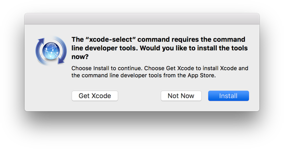
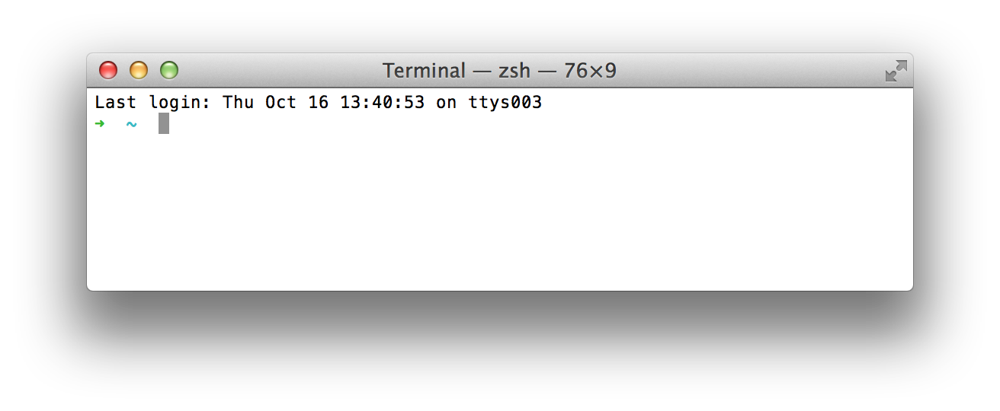

# Instruções

As instruções abaixo te ajudarão a:

- Ter um editor de texto (Sublime Text 3)
- Instalar um package manager no seu Linux
- Melhorar seu Terminal
- Setup Git e GitHub
- Instalar o Ruby


## Command Line Tools

Abra o terminal e digite o seguinte código:

```bash
xcode-select --install
```

Caso receba o seguinte código, poderá pular este passo e seguir ao próximo.

```
# command line tools are already installed, use "Software Update" to install updates
```

Senão, uma janela se abrirá perguntando se você quer instalar alguns softwares. Aceite e espere. Caso falhe, tente novamente a linha de comando acima (algumas vezes os servidores Apple estarão sobrecarregados).



Enquanto o software é baixado, você pode prosseguir e configurar sua conta no GitHub, mas **pare antes do Homebrew**. Você precisará das ferramentas que estão sendo instaladas.


## Conta no GitHub

Se ainda não tem uma conta no GitHub, [crie ela aqui](https://github.com/join).

:point_right: **[Ajuste seu perfil aqui](https://github.com/settings/profile)** e ponha um nome e uma foto que dê para reconhecer, por favor.


## Homebrew

No Mac, você precisa instalar [Homebrew](http://brew.sh/), um Package Manager. Ele será utilizado assim que precisarmos instalar algum software.
Para fazer isso, abra seu terminal e rode:

```bash
ruby -e "$(curl -fsSL https://raw.githubusercontent.com/Homebrew/install/master/install)"
```
Isso irá pedir sua confirmação (basta apertar `Enter`) e a senha de sua máquina.

Se você já tiver o Homebrew instalado, será avisado disso e você pode apenas prosseguir.

Para instalar alguns softwares úteis, rode:

```bash
brew update
```

Se receber um erro `/usr/local must be writable`, rode:

```bash
sudo chown -R $USER:admin /usr/local
brew update
```

Com ou sem erro, prossiga rodando o seguinte código no seu Terminal (pode copiar e colar tudo de uma só vez e apertar `Enter`):

```bash
function install_or_upgrade { brew ls | grep $1 > /dev/null; if (($? == 0)); then brew upgrade $1; else brew install $1; fi }
install_or_upgrade "git"
install_or_upgrade "wget"
install_or_upgrade "imagemagick"
install_or_upgrade "jq"
install_or_upgrade "openssl"
```


## Sublime Text 3 - Your text editor

Para baixar o Sublime Text em sua máquina, vá para [essa página](http://www.sublimetext.com/3) e baixe **Sublime Text 3** para OS X. Instale-o (clicando duas vezes no arquivo baixado e arrastando o aplicativo para a pasta `Applications`, **não pule esta etapa**). Se você tinha o Sublime Text 2 instalado antes, desinstale-o (basta arrastá-lo para o lixo).

Sublime Text é um de vários editores de texto. É gratuito, mas de vez em quando aparecerá um popup perguntando se quer comprar uma licença. Caso não queira, apenas aperte `Esc` e o popup sumirá.

## Oh-my-zsh

Usaremos um tipo diferente de shell: o `zsh` (o default é o `bash`).

```bash
sh -c "$(curl -fsSL https://raw.githubusercontent.com/robbyrussell/oh-my-zsh/master/tools/install.sh)"
```

Cuidado, sua senha será requisitada. Ao fim da instalação seu prompt deverá parecer com isso:


```bash
         __                                     __
  ____  / /_     ____ ___  __  __   ____  _____/ /_
 / __ \/ __ \   / __ `__ \/ / / /  /_  / / ___/ __ \
/ /_/ / / / /  / / / / / / /_/ /    / /_(__  ) / / /
\____/_/ /_/  /_/ /_/ /_/\__, /    /___/____/_/ /_/
                        /____/                       ....is now installed!
```

Agora feche o terminal (`⌘` + `Q`) e abra-o novamente.

Você deverá ver algo como isso



Se não parecer, algo deu errado. **Pergunte ao Professor** (ou à internet) como resolver o problema (caso não saiba como resolver sozinho)

Você pode mudar a aparência do seu Terminal! Entre em `Terminal > Preferences`, escolha seu tema e clique em `Default` (canto inferior esquerdo) para que este seja o tema sempre que abrir uma nova janela.


## GitHub

Você precisará gerar uma chave (denomidada SSH key) para autenticar sua máquina tanto no GitHub quanto no outro site que usaremos mais para frente: o Heroku. Caso já tenha feito isso, pode simplesmente pular esse passo e seguir ao próximo.

Abra seu terminal e escreva isso. **CUIDADO**, você terá que substituir `SEU_EMAIL@AQUI.COM` pelo seu email (não copie e cole cegamente). O email deverá ser o mesmo que usou para se cadastrar no GitHub. Essa linha irá requisitar algumas informações. Aperte `Enter` até que **uma senha seja requisitada**.

```bash
mkdir -p ~/.ssh && ssh-keygen -t ed25519 -o -a 100 -f ~/.ssh/id_ed25519 -C "TYPE_YOUR_EMAIL@HERE.com"
```

Quando a senha for requisitada, ponha algo que você irá lembrar. É uma senha que protegerá sua SSH key **privada** guardada no seu HD. Se achar que não precisa de uma senha, apenas aperte `Enter`.

Agora você precisará dar sua SSH key **pública** ao GitHub. Para isso, cole no terminal:

```bash
cat ~/.ssh/id_ed25519.pub
```

Isso irá printar a informação contida no arquivo de caminho absoluto `~/.ssh/id_ed25519.pub`. Copie esse texto, vá em [github.com/settings/ssh](https://github.com/settings/ssh), clique em **Add SSH key**, ponha como título o nome do seu computador e cole a informação abaixo. Salve a chave clicando em **Add key**.

Para verificar se o processo foi bem sucedido, rode isso. O terminal irá printar um aviso. Digite `yes` e aperte `Enter`.

```bash
ssh -T git@github.com
```

Se algo como isso aparecer, tudo ocorreu como esperado :)

```bash
# Hi --------! You've successfully authenticated, but GitHub does not provide shell access
```

Caso não funcione, tente rodar isso antes de tentar de novo o comando `ssh -T`:

```bash
ssh-add ~/.ssh/id_ed25519
```

Caso tenha interesse em entender melhor o que aconteceu, [leia esse artigo](http://sebastien.saunier.me/blog/2015/05/10/github-public-key-authentication.html) (em inglês).


## Dotfiles

:arrow_right: [Clique aqui para **forkear**](https://github.com/RafaelAlonso/TeStDotfiles/fork)os arquivos de configuração (a.k.a `dotfiles`). Forkear significa criar um novo repositório em sua conta, idêntico ao repositório original. Isso é necessário porque você irá por informações específicas (seu nome) nesses arquivos para personalizar sua máquina.

Abra seu terminal e digite a seguinte linha (**NÃO COPIE E COLE**), substituindo `seu_nome_no_github` por, bem, seu nome no github.

```bash
export GITHUB_USERNAME=seu_nome_no_github
```

Agora copie e cole essa linha. **NÃO É NECESSÁRIO ALTERAR**.

```bash
mkdir -p ~/code/$GITHUB_USERNAME && cd $_ && git clone git@github.com:$GITHUB_USERNAME/dotfiles.git
```

Rode o instalador `dotfiles`:

```bash
cd ~/code/$GITHUB_USERNAME/dotfiles
zsh install.sh
```

Rode o installador `git`:

```bash
cd ~/code/$GITHUB_USERNAME/dotfiles
zsh git_setup.sh
```

:point_up: Isso pedirá seu nome (o primeiro e o último) e seu email.

Cuidado, pois o email precisa ser o **mesmo** que o seu email cadastrado no GitHub!

Ao terminar, feche todas as janelas do Terminal.

### Sublime Text auto-configuração

Abra uma nova janela e digite isso:

```bash
stt
```

Isso abrirá o Sublime Text na sua pasta atual. **Feche-o e abra novamente**.

**Espere 1 minuto**. Pacotes de personalização (adicionados no passo de `Dotfiles`) serão automaticamente instalados (novas Tabs aparecerão cada vez que um pacote terminar de ter sido instalado, apresentando mais informações sobre o console).

Para checar todos os plugins / pacotes instalados, basta pressionar `Ctrl` + `⇧` + `P` para abrir a Paleta de Comandos, digitar `Packlist` e pressionar `Enter`. Você verá uma lista dos pacotes / plugins já instalados (como [Emmet](http://emmet.io/)).

Caso algo dê errado e você não consiga encontrá-los, por favor instale-os manualmente. A lista de pacotes que você deve possuir estão listadas [aqui](https://github.com/RafaelAlonso/TeStDotfiles/blob/master/Package%20Control.sublime-settings)

Ao terminar, poderá fechar o Sublime Text.


### SSH Passphrase

No seu terminal, rode este comando:

```bash
sw_vers
```

Se sua versão do OS (`ProductVersion`) é maior ou igual a **10.12**, continue com esta etapa. :warning: Senão, pule-a e vá diretamente para a instalação do Ruby.

Para não ter que reescrever sua senha para a chave SSH em todo `git push`, você poderá criar um arquivo `~/.ssh/config`:

```bash
touch ~/.ssh/config  # Creates the file if it does not exist
st ~/.ssh/config     # Opens the file in Sublime text
```

E adicionar essas 3 linhas ao arquivo. **Não esqueça de salvar**.

```bash
Host *
  AddKeysToAgent yes
  UseKeychain yes
```


## Instalando o Ruby (com [rbenv](https://github.com/sstephenson/rbenv))

Para ter certeza que não estará instalando nada duplicado, copie e cole isso no seu terminal para limpar qualquer instalação Ruby que você tenha feito anteriormente:

```bash
rvm implode && sudo rm -rf ~/.rvm
# If you got "zsh: command not found: rvm", carry on. It means `rvm` is not
# on your computer, that's what we want!

sudo rm -rf $HOME/.rbenv /usr/local/rbenv /opt/rbenv /usr/local/opt/rbenv
```

Agora vamos instalar os pacotes [`rbenv`](https://github.com/rbenv/rbenv) e [`ruby-build`](https://github.com/rbenv/ruby-build) a partir do Homebrew. Eles serão úteis.

Primeiro, desinstale qualquer um dos dois (caso tenha) para garantirmos que nada será duplicado.

```bash
brew uninstall --force rbenv ruby-build
```

Em seguida, **feche todas as janelas do seu terminal** (Cmd + Q) e abra-o. Então rode:

```bash
brew install rbenv
```

**Feche seu terminal e abra-o novamente**.

Agora você estará pronto para usar a versão 2.4.4 e colocá-la como a versão default. Rode o seguinte comando (**costuma demorar de 5 a 10 minutos**).

```bash
rbenv install 2.4.4
```

Quando a instalação for concluída, rode esse comando para dizer ao sistema para usar a versão 2.4.4 por default.

```bash
rbenv global 2.4.4
```

Agora **reinicie** seu Terminal mais uma vez e rode o seguinte comando:

```bash
ruby -v
```

Você deverá ver algo começando com `ruby 2.4.4p`. Se não, procure por ajuda.


## Instalando gemas

Rode o seguinte comando:

```bash
gem install rake bundler rspec rubocop pry pry-byebug hub colored octokit
```

**Nunca** instale uma gema com `sudo gem install`, mesmo que encontre uma resposta no Stackoverflow (ou no próprio Terminal) pedindo que você faça isso!!


## Postgresql

Postgresql é um banco de dados open-source robusto e production-ready. Mais para frente será útil, então instale-o agora rodando o seguinte comando:

```bash
brew install postgresql
brew services start postgresql
```

Quando tudo estiver pronto, cheque se está funcionando:

```bash
psql -d postgres
```

Se receber um prompt como o abaixo, significa que tudo ocorreu como esperado.

```bash
psql (9.5.3)
Type "help" for help.

postgres=#
```

Para sair deste modo, digite `\q` e aperte `Enter`.


## Check-up

Por fim, veja se tudo está instalado corretamente

Feche todas as janelas do seu terminal, abra uma nova e rode o seguinte comando:
```bash
curl -Ls https://raw.githubusercontent.com/RafaelAlonso/TeSt/master/check.rb > _.rb && ruby _.rb || rm _.rb
```

Isso deverá mostrar que está tudo pronto. Se não, procure por ajuda.


## Teclado

Como programador, você entende (ou entenderá) que deixar o teclado demora muito tempo, então gostará de minimzar o uso de seu trackpad ou mouse. Aqui estão alguns truques no OSX para alcançar isso:

### Velocidade do Teclado

Vá para  > System Preferences > Keyboard. Configure `Key Repeat` para a posição mais rápida (mais a direita) e `Delay Until Repeat` para a posição mais curta (mais a direita).

### Acesso Total ao Teclado

Vá para  > System Preferences > Keyboard. Clique na terceira aba (Shortcuts / Atalhos). No fim da janela, clique em `All controls` / `Todos os controles`. Dessa forma, quando tiver um diálogo com diversas opções, poderá apertar `Enter` para confirmar ou `Espaço` para escolher a opção de cancelar. Se tiver mais de duas opções, poderá pressionar `Tab` para circular por entre elas.

### macOS For hackers

[Leia esse script](https://github.com/mathiasbynens/dotfiles/blob/master/.macos) e escolha o que lhe preferir! Por exemplo, poderá escrever no terminal essa:

```bash
# Expanding the save panel by default
defaults write NSGlobalDomain NSNavPanelExpandedStateForSaveMode -bool true
defaults write NSGlobalDomain PMPrintingExpandedStateForPrint -bool true
defaults write NSGlobalDomain PMPrintingExpandedStateForPrint2 -bool true

# Save screenshots to the Desktop (or elsewhere)
defaults write com.apple.screencapture location -string "${HOME}/Desktop"

# etc..
```


